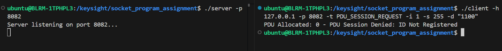
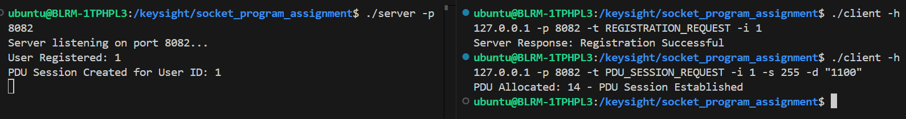
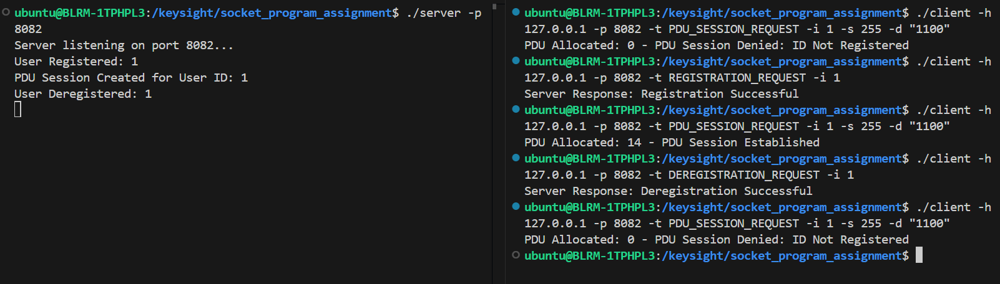
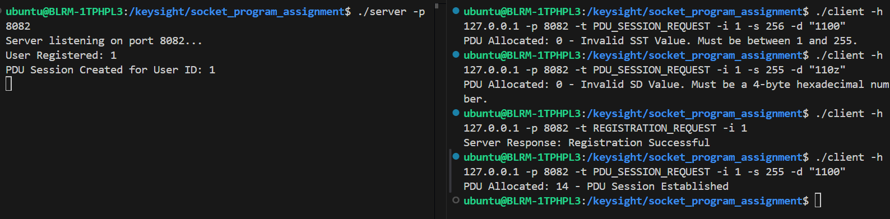

# Protobuf-based Client-Server Communication

This project demonstrates a client-server communication model using Protocol Buffers (protobuf) in C++.

## Prerequisites

Ensure you have the following installed on your system:
- `protoc` (Protocol Buffer Compiler)
- `g++` (GCC compiler supporting C++14)
- `protobuf` library

## Installation of Dependencies

To install all required dependencies, run:
```sh
sudo apt update && sudo apt install -y protobuf-compiler libprotobuf-dev g++
```

## Compilation Steps

1. **Generate C++ Code from `.proto` File**
   ```sh
   protoc --cpp_out=. message.proto
   ```
   This generates `message.pb.cc` and `message.pb.h`.

2. **Compile the Server**
   ```sh
   g++ -std=c++14 server.cpp message.pb.cc -o server -lprotobuf
   ```

3. **Compile the Client**
   ```sh
   g++ -std=c++14 client.cpp message.pb.cc -o client -lprotobuf
   ```

## Running the Server and Client

1. **Start the Server**
   ```sh
   ./server
   ```

2. **Run the Client with Different Requests**

   - **Registration Request:**
     ```sh
     ./client -h 127.0.0.1 -p 8082 -t REGISTRATION_REQUEST -i 1
     ```

   - **PDU Session Request:**
     ```sh
     ./client -h 127.0.0.1 -p 8082 -t PDU_SESSION_REQUEST -i 1 -s 255 -d "1100"
     ```

   - **Deregistration Request:**
     ```sh
     ./client -h 127.0.0.1 -p 8082 -t DEREGISTRATION_REQUEST -i 1
     ```

## Explanation of Command-line Arguments

| Argument | Description |
|----------|-------------|
| `-h` | Server hostname or IP (e.g., `127.0.0.1`) |
| `-p` | Server port number (e.g., `8082`) |
| `-t` | Type of request (`REGISTRATION_REQUEST`, `PDU_SESSION_REQUEST`, `DEREGISTRATION_REQUEST`) |
| `-i` | Identifier (e.g., `1`) |
| `-s` | Session ID (only for `PDU_SESSION_REQUEST`) |
| `-d` | Data payload (only for `PDU_SESSION_REQUEST`) |


Sample Output







